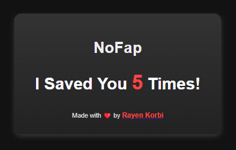

# NoFap

## Description
The NoFap Extension is a browser tool designed to block access to pornographic websites seamlessly. Unlike other blockers that require users to add URLs manually, this extension automatically bans such websites without the need for user intervention. It provides a simple and effective solution for those seeking to limit their exposure to explicit content online.

## Features
- Automatically blocks access to pornographic websites.
- We currently block up to 36000 porn websites(yeah your favorite website is there too).
- No need to manually add or load URLs.
- Simple and straightforward functionality with no complex UI.
- No data collection.

## Target
- Guys.
- Girls.

## Installation

### Chrome (Chromium-based browsers)

#### Windows/macOS/Linux

1.  Clone the [extension repository](https://github.com/korbirayen/NoFap) or [download](https://github.com/korbirayen/NoFap/blob/main/noFap.zip).
2.  Open Chrome/Edge and navigate to `chrome://extensions/` or `edge://extensions/`.
3.  Enable Developer Mode by toggling the switch in the upper-right corner.
4.  Click on the "Load unpacked" button located at the top-left corner of the extensions page.
5.  Select the directory where you cloned or downloaded the extension repository.
6.  Confirm the installation when prompted.
7.  To run the extension in incognito mode: right-click the extension icon, go to "Manage extension," and toggle on "Allow in Incognito."

### Firefox

#### Windows/macOS/Linux

1.  Clone the [extension repository](https://github.com/korbirayen/NoFap) or [download](https://github.com/korbirayen/NoFap/blob/main/noFap-firefox.zip).
2.  Open Firefox and type `about:debugging` in the address bar, then press Enter.
3.  Click on "This Firefox" in the left sidebar.
4.  Click on the "Load Temporary Add-on" button.
5.  Navigate to the directory where you cloned or downloaded the extension, then select the `manifest.json` file.
6.  Confirm the installation when prompted.
7.  To grant permissions: click the extensions icon, right-click the NoFap extension, and click "Manage Extension." Go to the "Permissions" tab and allow the toggle for "Access data on all websites."
8.  To run in a private window: in the "Details" tab, click "Allow" for the "Run in Private Window" option.

## Usage
1. Once installed, the extension will automatically block access to pornographic websites.
2. Simply browse the web as usual, and the extension will take care of the rest.

## Compatibility
This extension is compatible with major Chromium-based browsers such as Google Chrome , Firefox , Brave , Opera ...

## Contributing
Contributions from the community are welcomes. If you'd like to contribute to the development of this extension, please fork the repository, make your changes, and submit a pull request.
If you found any issue, please raise an issue

Stay focused and enjoy a distraction-free browsing experience with NoFap!
